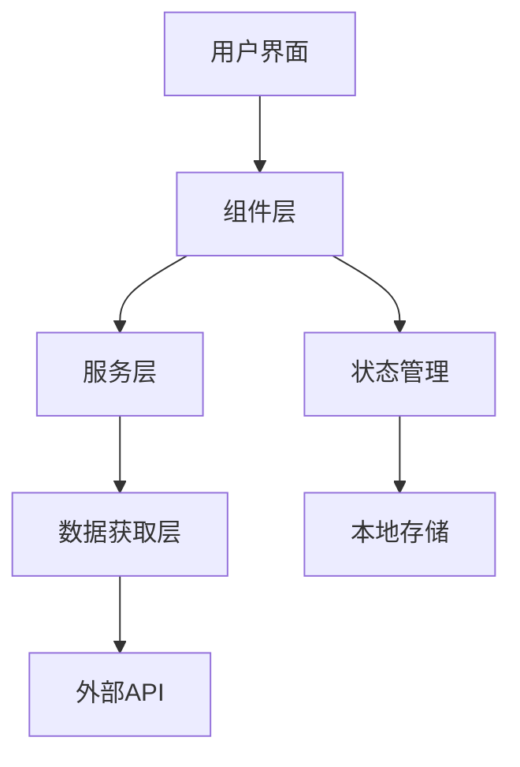
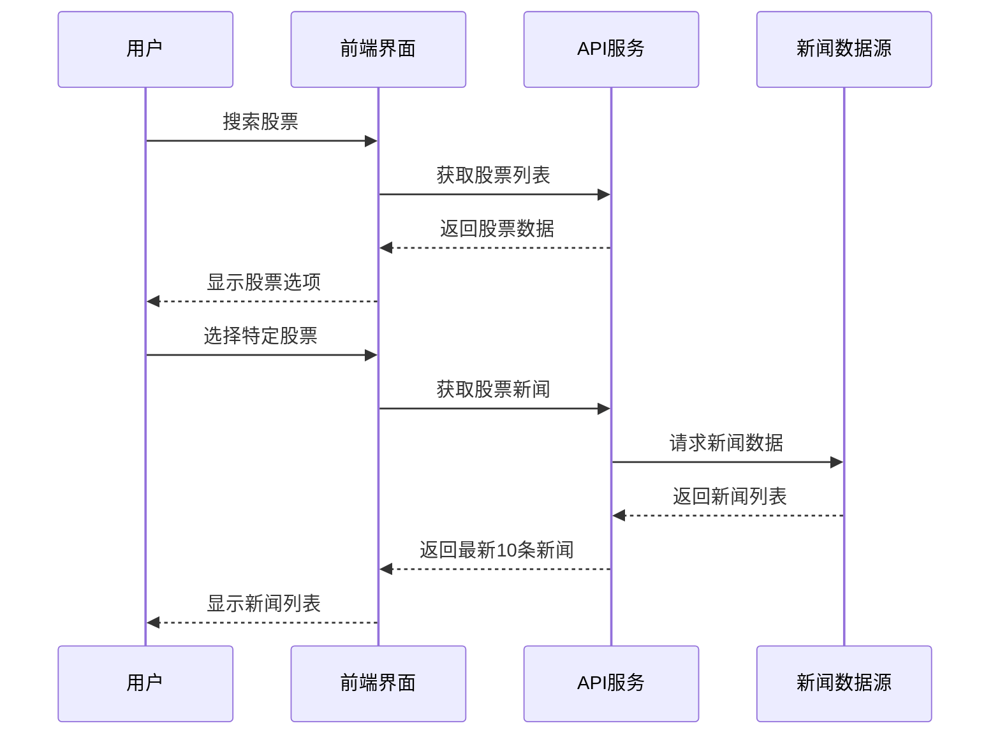
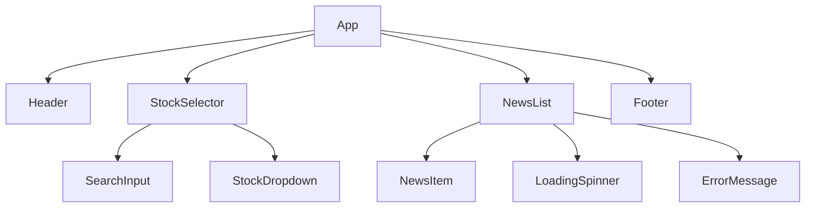
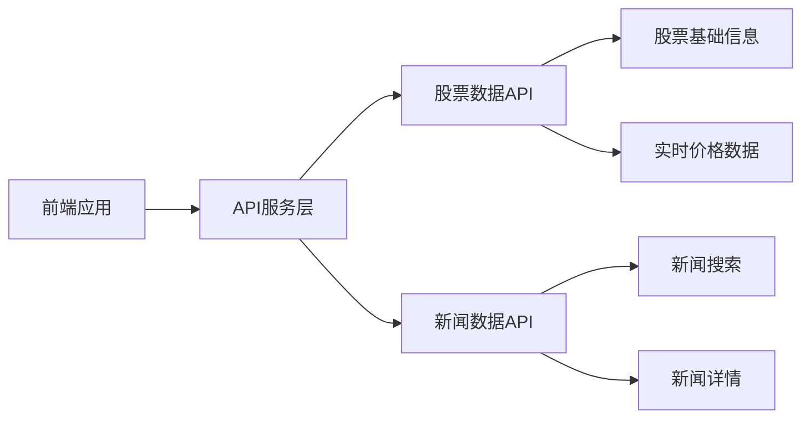
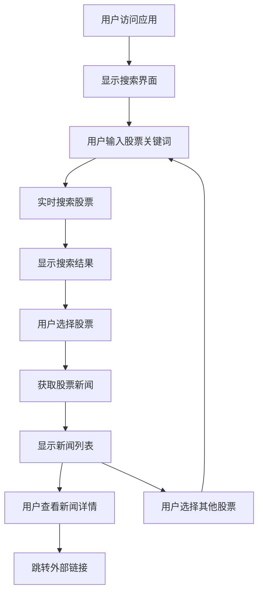
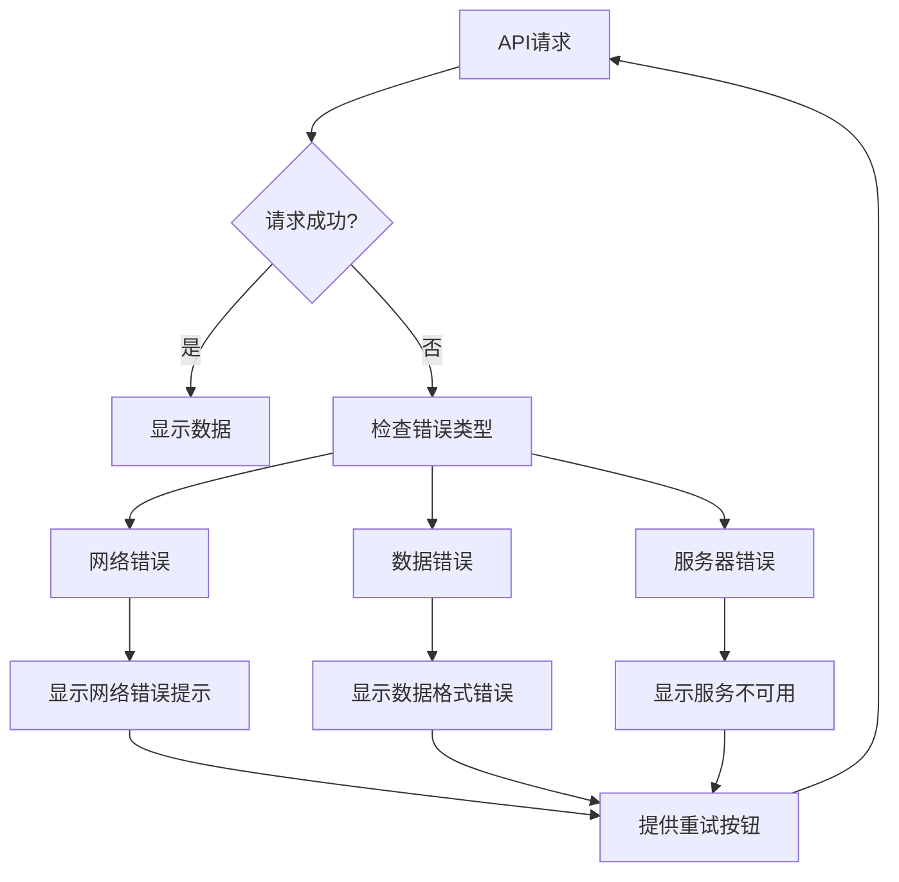

# A股新闻浏览工具设计文档

## 1. 概述

A股新闻浏览工具是一个前端应用程序，允许用户选择A股股票并查看相关的最新新闻。该工具提供直观的用户界面，帮助投资者快速获取感兴趣股票的最新资讯。

### 核心功能
- 股票搜索和选择
- 显示选中股票的最新10条新闻
- 响应式设计，支持多设备访问

### 技术栈
- 前端框架：React 18
- 状态管理：React Hooks (useState, useEffect)
- 样式框架：Tailwind CSS
- HTTP 客户端：Axios
- 构建工具：Vite
- 包管理器：npm

## 2. 架构设计

### 2.1 整体架构



### 2.2 数据流设计



## 3. 组件架构

### 3.1 组件层次结构



### 3.2 核心组件定义

#### App 组件
- **职责**：应用程序的根组件，管理全局状态
- **状态**：
  - `selectedStock`: 当前选中的股票信息
  - `newsList`: 新闻列表数据
  - `loading`: 加载状态
  - `error`: 错误信息

#### StockSelector 组件
- **职责**：股票搜索和选择功能
- **Props**：
  - `onStockSelect`: 股票选择回调函数
  - `selectedStock`: 当前选中的股票
- **状态**：
  - `searchTerm`: 搜索关键词
  - `stockOptions`: 搜索结果列表
  - `isDropdownOpen`: 下拉菜单状态

#### NewsList 组件
- **职责**：显示新闻列表
- **Props**：
  - `news`: 新闻数据数组
  - `loading`: 加载状态
  - `error`: 错误信息
  - `stockName`: 股票名称

#### NewsItem 组件
- **职责**：单条新闻项的显示
- **Props**：
  - `title`: 新闻标题
  - `summary`: 新闻摘要
  - `publishTime`: 发布时间
  - `source`: 新闻来源
  - `url`: 新闻链接

### 3.3 组件使用示例

```jsx
// App 组件使用示例
function App() {
  const [selectedStock, setSelectedStock] = useState(null);
  const [newsList, setNewsList] = useState([]);
  const [loading, setLoading] = useState(false);
  const [error, setError] = useState(null);

  return (
    <div className="min-h-screen bg-gray-50">
      <Header />
      <main className="container mx-auto px-4 py-8">
        <StockSelector 
          onStockSelect={setSelectedStock}
          selectedStock={selectedStock}
        />
        <NewsList 
          news={newsList}
          loading={loading}
          error={error}
          stockName={selectedStock?.name}
        />
      </main>
      <Footer />
    </div>
  );
}
```

## 4. 数据模型

### 4.1 股票数据模型

| 字段 | 类型 | 描述 | 示例 |
|------|------|------|------|
| code | string | 股票代码 | "000001" |
| name | string | 股票名称 | "平安银行" |
| market | string | 市场类型 | "SZ" / "SH" |
| price | number | 当前价格 | 12.35 |
| change | number | 涨跌幅 | 0.05 |

### 4.2 新闻数据模型

| 字段 | 类型 | 描述 | 示例 |
|------|------|------|------|
| id | string | 新闻唯一标识 | "news_123456" |
| title | string | 新闻标题 | "平安银行发布三季度财报" |
| summary | string | 新闻摘要 | "平安银行公布2024年第三季度业绩..." |
| publishTime | string | 发布时间 | "2024-01-15T10:30:00Z" |
| source | string | 新闻来源 | "财经网" |
| url | string | 新闻链接 | "https://example.com/news/123" |
| stockCode | string | 相关股票代码 | "000001" |

## 5. API集成层

### 5.1 API服务架构



### 5.2 API接口定义

#### 股票搜索接口
```
GET /api/stocks/search?q={searchTerm}

响应格式：
{
  "data": [
    {
      "code": "000001",
      "name": "平安银行",
      "market": "SZ",
      "price": 12.35,
      "change": 0.05
    }
  ],
  "total": 1
}
```

#### 股票新闻接口
```
GET /api/news/stock/{stockCode}?limit=10

响应格式：
{
  "data": [
    {
      "id": "news_123456",
      "title": "平安银行发布三季度财报",
      "summary": "平安银行公布2024年第三季度业绩...",
      "publishTime": "2024-01-15T10:30:00Z",
      "source": "财经网",
      "url": "https://example.com/news/123",
      "stockCode": "000001"
    }
  ],
  "total": 10
}
```

### 5.3 API服务实现

#### StockService
```javascript
class StockService {
  static async searchStocks(searchTerm) {
    const response = await axios.get(`/api/stocks/search?q=${searchTerm}`);
    return response.data;
  }
  
  static async getStockInfo(stockCode) {
    const response = await axios.get(`/api/stocks/${stockCode}`);
    return response.data;
  }
}
```

#### NewsService
```javascript
class NewsService {
  static async getStockNews(stockCode, limit = 10) {
    const response = await axios.get(`/api/news/stock/${stockCode}?limit=${limit}`);
    return response.data;
  }
}
```

## 6. 状态管理

### 6.1 状态结构

```javascript
const AppState = {
  // 股票相关状态
  stocks: {
    searchResults: [],
    selectedStock: null,
    loading: false,
    error: null
  },
  
  // 新闻相关状态
  news: {
    list: [],
    loading: false,
    error: null,
    lastUpdated: null
  },
  
  // UI状态
  ui: {
    sidebarOpen: false,
    theme: 'light'
  }
};
```

### 6.2 状态管理 Hooks

#### useStockData Hook
```javascript
function useStockData() {
  const [stocks, setStocks] = useState([]);
  const [selectedStock, setSelectedStock] = useState(null);
  const [loading, setLoading] = useState(false);
  const [error, setError] = useState(null);

  const searchStocks = async (searchTerm) => {
    setLoading(true);
    try {
      const result = await StockService.searchStocks(searchTerm);
      setStocks(result.data);
      setError(null);
    } catch (err) {
      setError(err.message);
    } finally {
      setLoading(false);
    }
  };

  return {
    stocks,
    selectedStock,
    loading,
    error,
    searchStocks,
    setSelectedStock
  };
}
```

#### useNewsData Hook
```javascript
function useNewsData() {
  const [newsList, setNewsList] = useState([]);
  const [loading, setLoading] = useState(false);
  const [error, setError] = useState(null);

  const fetchNews = async (stockCode) => {
    if (!stockCode) return;
    
    setLoading(true);
    try {
      const result = await NewsService.getStockNews(stockCode);
      setNewsList(result.data);
      setError(null);
    } catch (err) {
      setError(err.message);
    } finally {
      setLoading(false);
    }
  };

  return {
    newsList,
    loading,
    error,
    fetchNews
  };
}
```

## 7. 样式设计策略

### 7.1 设计系统

#### 颜色方案
```css
:root {
  /* 主色调 */
  --primary: #1e40af;
  --primary-hover: #1d4ed8;
  
  /* 辅助色 */
  --secondary: #64748b;
  --success: #059669;
  --warning: #d97706;
  --error: #dc2626;
  
  /* 中性色 */
  --gray-50: #f8fafc;
  --gray-100: #f1f5f9;
  --gray-900: #0f172a;
}
```

#### 字体系统
```css
.text-xs { font-size: 0.75rem; }
.text-sm { font-size: 0.875rem; }
.text-base { font-size: 1rem; }
.text-lg { font-size: 1.125rem; }
.text-xl { font-size: 1.25rem; }
.text-2xl { font-size: 1.5rem; }
```

### 7.2 响应式设计

```css
/* 移动端优先设计 */
.container {
  @apply px-4;
}

/* 平板端 */
@media (min-width: 768px) {
  .container {
    @apply px-6;
  }
}

/* 桌面端 */
@media (min-width: 1024px) {
  .container {
    @apply px-8 max-w-6xl mx-auto;
  }
}
```

## 8. 用户交互流程

### 8.1 主要用户流程



### 8.2 错误处理流程



## 9. 性能优化策略

### 9.1 组件优化
- 使用 React.memo 避免不必要的重渲染
- 实现 useMemo 和 useCallback 优化计算和函数引用
- 延迟加载非关键组件

### 9.2 数据获取优化
- 实现防抖搜索，减少API调用频率
- 缓存股票搜索结果
- 实现新闻数据的分页加载

### 9.3 代码分割
```javascript
// 懒加载新闻详情组件
const NewsDetail = lazy(() => import('./components/NewsDetail'));

// 在组件中使用
<Suspense fallback={<LoadingSpinner />}>
  <NewsDetail newsId={selectedNewsId} />
</Suspense>
```

## 10. 测试策略

### 10.1 单元测试
- 组件渲染测试
- Hook 功能测试
- 工具函数测试
- API服务测试

### 10.2 集成测试
- 用户交互流程测试
- API集成测试
- 状态管理测试

### 10.3 测试工具
- **单元测试**：Jest + React Testing Library
- **端到端测试**：Cypress
- **视觉回归测试**：Storybook + Chromatic

### 10.4 测试用例示例

```javascript
// StockSelector 组件测试
describe('StockSelector', () => {
  test('应该在用户输入时显示搜索结果', async () => {
    render(<StockSelector onStockSelect={jest.fn()} />);
    
    const searchInput = screen.getByPlaceholderText('搜索股票...');
    fireEvent.change(searchInput, { target: { value: '平安' } });
    
    await waitFor(() => {
      expect(screen.getByText('平安银行')).toBeInTheDocument();
    });
  });
  
  test('应该在选择股票时调用回调函数', () => {
    const mockOnSelect = jest.fn();
    render(<StockSelector onStockSelect={mockOnSelect} />);
    
    const stockOption = screen.getByText('平安银行');
    fireEvent.click(stockOption);
    
    expect(mockOnSelect).toHaveBeenCalledWith({
      code: '000001',
      name: '平安银行'
    });
  });
});
```